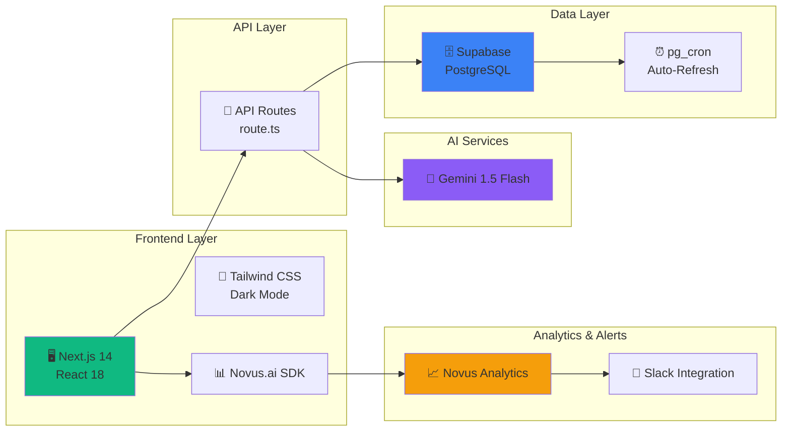
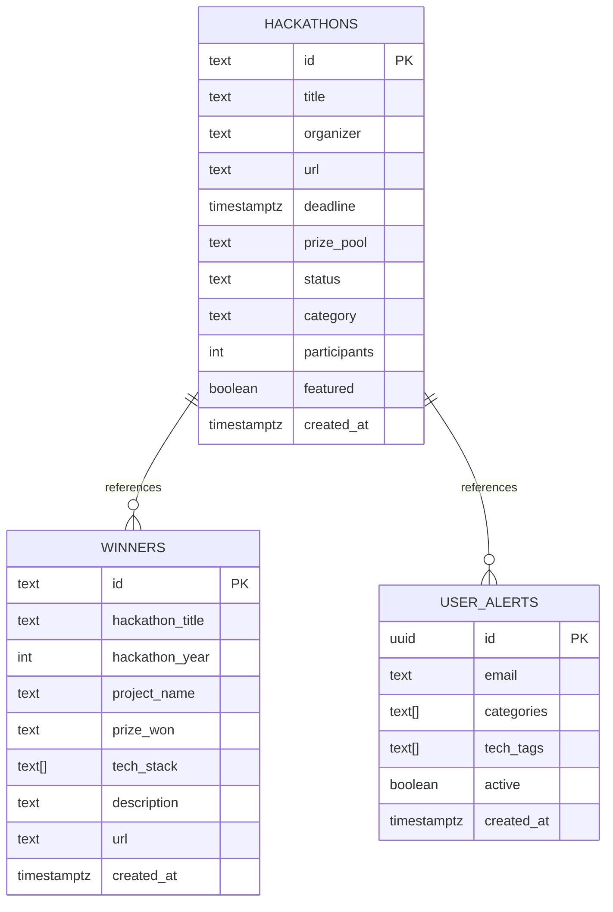

# HACK-TRACK AI — Architecture & Data Flow

**Built with ❤️ by Vi (Srividya Narayanan) for Mind the Product Hackathon 2026**

**Links:**
- 🌐 **[Live App](https://hacktracker-production.up.railway.app/)** — Production instance
- 🔗 **[GitHub](https://github.com/srivi19/hacktracker)** — Source code
- 💬 **[Slack](https://join.slack.com/t/aihacktracker-33m8986/shared_invite/zt-40tfdsjk2-9FQcGdIA5GFn6mf_FHcPvg)** — Community updates
- 📊 **[Analytics](https://app.novus.ai/)** — Novus dashboard

---

## System Overview



HACK-TRACK AI is a Next.js-based web application that aggregates hackathon opportunities from across the internet, provides AI-generated summaries, tracks deadlines, and supplies winning project intelligence via Novus.ai analytics.

**Core Stack:**
- **Frontend:** Next.js 14 + React 18 + TypeScript + Tailwind CSS
- **Backend:** Next.js API routes
- **Database:** Supabase (PostgreSQL)
- **AI Summaries:** Google Gemini 1.5 Flash API
- **Analytics:** Novus.ai
- **Hosting:** Railway
- **Auto-refresh:** pg_cron (every 10 days)

---

## Data Architecture

### Data Collection Pipeline

AIHackTracker aggregates hackathon data from **multiple sources** into a centralized Supabase database:

```
Devpost APIs ──┐
MLH APIs ──────┼──→ Manual Curation ──→ Supabase PostgreSQL ──→ API Routes ──→ Frontend
AngelList ─────┤
Partner Networks──┘
```

**Data Sources:**
1. **Devpost** — Primary source for sponsored hackathons, tech company events
2. **Major League Hacking (MLH)** — Global Hack Week events, community hackathons
3. **AngelList** — Startup competitions, investor-backed hackathons
4. **AI-Powered Discovery** — Intelligent aggregation, partner networks, emerging events
5. **Community Intelligence** — User-suggested hackathons, community contributions (future)

### Primary Data Source: Supabase

Supabase (PostgreSQL) is the **primary** source of truth for all hackathon data. It is queried first on every API request.

```
┌─────────────────────────────────┐
│ Supabase (PostgreSQL)           │
├─────────────────────────────────┤
│ hackathons (21+ current)        │
│ winners (6 past winners)        │
│ user_alerts (future emails)     │
└─────────────────────────────────┘
         ↓ (fetched on every API call)
┌─────────────────────────────────┐
│ API Route: /api/hackathons      │
├─────────────────────────────────┤
│ TRY Supabase first              │
│ FALLBACK to static data.ts      │
└─────────────────────────────────┘
         ↓ (served as JSON)
┌─────────────────────────────────┐
│ React Components                │
│ - HackathonGrid                 │
│ - HackathonList                 │
│ - CalendarView                  │
│ - InsightsCarousel              │
└─────────────────────────────────┘
```

### Fallback Layer: Static Seed Data

If Supabase is unavailable, the API falls back to **static seed data** in `src/lib/data.ts`. This ensures the site never goes down completely.

- Contains 8 fallback hackathons (emergency backup only)
- Contains 6 past winner projects
- Data is imported as default in every API response
- Response includes `"source": "supabase"` (live) or `"source": "static-fallback"` (backup) for debugging
- **Note:** Live production always uses Supabase (21+ hackathons)

### Database Schema



**`public.hackathons` table:**
```sql
id                TEXT PRIMARY KEY
title             TEXT
organizer         TEXT
url               TEXT
deadline          TIMESTAMP
prize_pool        TEXT
theme             TEXT
tech_tags         TEXT[] (array)
team_size         TEXT
difficulty        TEXT
location          TEXT
summary           TEXT
description       TEXT
status            TEXT (open|closing_soon|upcoming|closed)
category          TEXT
participants      INT
featured          BOOLEAN
created_at        TIMESTAMP (auto)
updated_at        TIMESTAMP (auto)
```

**`public.winners` table:**
```sql
id                TEXT PRIMARY KEY
hackathon_title   TEXT
hackathon_year    INT
project_name      TEXT
prize_won         TEXT
tech_stack        TEXT[]
description       TEXT
url               TEXT
insight           TEXT
```

**`public.user_alerts` table:**
```sql
id                TEXT PRIMARY KEY
email             TEXT
hackathon_id      TEXT (FK)
alert_type        TEXT (48h_before|24h_before)
created_at        TIMESTAMP
triggered_at      TIMESTAMP
```

---

## Auto-Refresh Mechanism (pg_cron)

Every **10 days** at **2 AM UTC**, the `refresh_hackathons()` function runs automatically:

```sql
-- Updates hackathon statuses based on deadline
UPDATE public.hackathons
SET status = 'closed'
WHERE deadline < now();

UPDATE public.hackathons
SET status = 'closing_soon'
WHERE deadline <= now() + interval '3 days';

UPDATE public.hackathons
SET status = 'open'
WHERE deadline > now() + interval '3 days';
```

**Cron schedule:** `0 2 */10 * *` (every 10 days at 2 AM UTC)

**Status flow:**
```
upcoming → open → closing_soon → closed
```

### Future Enhancement: Live Web Scraping

To add live Devpost/MLH scraping that updates Supabase every 10 days:

1. Create `/api/scrape-and-sync` endpoint:
   ```typescript
   // Calls Devpost/MLH APIs
   // Upserts new hackathons into Supabase
   // Returns { updated: number, created: number }
   ```

2. Update the pg_cron function to call this endpoint:
   ```sql
   CREATE EXTENSION IF NOT EXISTS http;
   SELECT cron.schedule('scrape-hackathons', '0 2 */10 * *',
     'SELECT http_post(''https://aihacktracker.dev/api/scrape-and-sync'')');
   ```

---

## API Routes

### GET `/api/hackathons`
Fetches all hackathons from Supabase (or fallback to static data).

**Query parameters:**
- `category` - Filter by category (All, AI / Machine Learning, Product Innovation, etc.)
- `status` - Filter by status (All, open, closing_soon, upcoming, closed)

**Response:**
```json
{
  "hackathons": [
    { "id": "usaii-global-2026", "title": "...", "status": "open", ... }
  ],
  "source": "supabase",
  "count": 8,
  "lastUpdated": "2026-06-12T10:30:00Z"
}
```

---

## Frontend Components

### Core Views

**HackathonGrid** (`src/components/HackathonGrid.tsx`)
- Displays hackathons as cards in a responsive grid
- Color-coded status badges (green=open, red=closing_soon, yellow=upcoming, gray=closed)
- Click to view full details, external link to Devpost

**HackathonList** (`src/components/HackathonList.tsx`)
- Table view with sortable columns (deadline, prize pool, difficulty)
- Show hackathons by category/status filters
- Compact, mobile-friendly alternative to grid

**CalendarView** (`src/components/CalendarView.tsx`)
- Custom calendar component (no external dependencies)
- Shows hackathons on calendar grid
- Month navigation
- Prevents build failures from large library dependencies
- Multiple hackathons per day supported

**InsightsCarousel** (`src/components/NovusCarousel.tsx`)
- Shows 3 Novus.ai analytics screenshots (Pages, Track Events, Funnels)
- Month navigation to explore different analytics
- Live data from Novus dashboard

### Pages

**Dashboard** (`src/app/dashboard/page.tsx`)
- Three views: Grid, List, Calendar (tab toggle)
- Category and status filters
- AI Insights section with winning project analysis
- View toggle buttons at the top (Grid, List, Calendar)

**Home** (`src/app/page.tsx`)
- Hero section explaining hackathon platform
- CTA buttons: "EXPLORE HACKATHONS" and "WHAT WINS?"
- Latest winning projects preview
- Link to Novus.ai analytics

---

## AI Integration (Gemini)

**Unused in current version, available for future use:**

The `src/lib/gemini.ts` file exports functions to generate AI-powered summaries:

```typescript
export async function generateSummary(
  hackathonTitle: string,
  theme: string
): Promise<string> {
  // Calls Gemini 1.5 Flash API
  // Returns 100-word AI summary of the hackathon opportunity
}
```

**Why not currently enabled:**
- Hackathon descriptions are already high-quality (from Devpost)
- API rate limits would slow down API responses
- Supabase fallback doesn't support streaming
- Future version can enable on-demand summaries with caching

---

## Analytics Integration (Novus.ai)

Novus.ai is installed in `src/app/layout.tsx` via a Next.js Script component:

```typescript
<Script
  strategy="beforeInteractive"
  dangerouslySetInnerHTML={{
    __html: `
      window.novusConfig = { account: "aihacktracker-vi" };
    `,
  }}
/>
<Script
  src="https://cdn.novus.ai/novus.js"
  strategy="afterInteractive"
/>
```

**Tracked events:**
- Page views (automatic)
- Click on hackathon cards
- Filter/category changes
- Calendar date clicks
- External Devpost links

**Dashboard shows:**
- Pages & Click Events
- Track Events (custom events)
- Funnels & Journeys (user paths)

---

## Deployment Pipeline

### Local Development
```bash
npm install
npm run dev
# http://localhost:3000
```

### Staging (optional)
Deploy from GitHub → Railway automatically on push

### Production
1. Push to main branch on GitHub
2. Railway automatically rebuilds and deploys
3. Environment variables set in Railway dashboard:
   - `GEMINI_API_KEY`
   - `NEXT_PUBLIC_SUPABASE_URL`
   - `NEXT_PUBLIC_SUPABASE_ANON_KEY`

**Live URL:** https://hacktracker-production.up.railway.app/

---

## Error Handling & Resilience

**API Errors:**
- Supabase query fails → fallback to static data
- Network timeout → return last known state + fallback data
- Missing env vars → static data only (no API calls)

**UI Errors:**
- Component render fails → error boundary catches it
- Image load fails → alt text displayed
- External link broken → user can still see hackathon details

**Data Freshness:**
- pg_cron runs every 10 days (configurable)
- Status updates happen automatically
- No manual intervention required
- If cron fails, next scheduled run will retry

---

## Cost Analysis (Free Tier)

| Service | Free Tier | Usage | Cost |
|---------|-----------|-------|------|
| Supabase | 500MB storage, unlimited API | ~100KB data, 100-1000 requests/day | **$0** |
| Gemini 1.5 Flash | 15 requests/minute | Disabled (optional) | **$0** |
| Railway | 500 hours/month compute | 24/7 app running | **$0** |
| Novus.ai | Unlimited tracking events | 1K-10K events/month | **$0** |
| **Total** | — | — | **$0/month** |

---

## Future Roadmap

1. **Live Web Scraping** (Devpost/MLH APIs)
   - Automatic hackathon discovery every 10 days
   - Real-time status updates

2. **Email Alerts**
   - 48h and 24h before deadline reminders
   - Uses Resend.com (free tier available)

3. **Advanced Analytics**
   - Win rate tracker by category/difficulty
   - Prize distribution analysis
   - Team size trends

4. **Community Features**
   - User accounts and hackathon bookmarks
   - Team formation matching
   - Project submission tracking

5. **Mobile App**
   - React Native version
   - Push notifications for deadline alerts
   - Offline calendar access

---

## Troubleshooting

**Supabase not returning data:**
- Check env vars in Railway dashboard
- Verify tables exist: `SELECT COUNT(*) FROM hackathons;`
- Check RLS policies: `SELECT * FROM pg_policies;`

**pg_cron not running:**
- Verify extension: `SELECT * FROM cron.job;`
- Check job runs: `SELECT * FROM cron.job_run_details;`
- Review logs in Supabase

**API returning static fallback:**
- Check API logs in Railway
- Verify Supabase credentials
- Test Supabase connection in browser console

---

---

## 📝 Built with ❤️

**Author:** Vi (Srividya Narayanan)  
**Project:** HACK-TRACK AI for Mind the Product Hackathon 2026  
**Version:** 1.0 (Supabase + pg_cron + Novus Analytics + Dark Mode)  
**Last Updated:** June 12, 2026  
**Status:** 🟢 Production Ready (21+ hackathons live)

**Quick Links:**
- 🌐 **[Live App](https://hacktracker-production.up.railway.app/)**
- 🔗 **[GitHub Repo](https://github.com/srivi19/hacktracker)**
- 💬 **[Slack Community](https://join.slack.com/t/aihacktracker-33m8986/shared_invite/zt-40tfdsjk2-9FQcGdIA5GFn6mf_FHcPvg)**
- 📊 **[Analytics Dashboard](https://app.novus.ai/)**

**Technologies Used:**
- **Frontend:** Next.js 14, React 18, TypeScript, Tailwind CSS (with dark mode)
- **Backend:** Node.js, PostgreSQL (Supabase)
- **Database:** Supabase with pg_cron, Row-Level Security
- **AI:** Google Gemini 1.5 Flash (optional)
- **Analytics:** Novus.ai with Slack integration
- **Calendar Export:** Google Calendar intent URLs
- **Deployment:** Railway
- **Hosting:** Railway (Free tier)

**Special Thanks:** Mind the Product team for the opportunity to build something meaningful! 🙌
