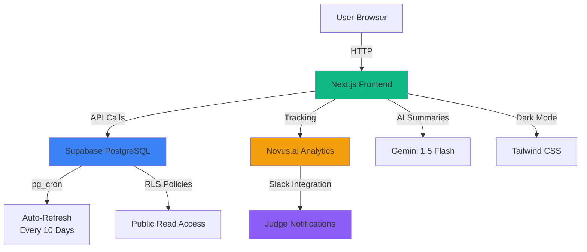
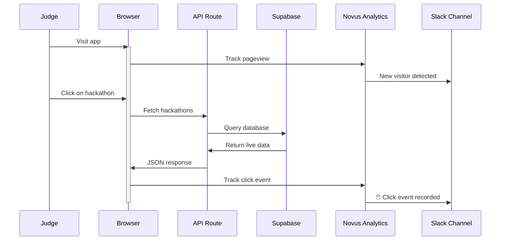

# AIHackTracker 🚀

> **The AI Hackathon Intelligence Platform** — Discover, track, and learn from the best AI hackathons happening now.
> 
> *Built with ❤️ for the Mind the Product Hackathon 2026*

**Live:** https://hacktracker-production.up.railway.app/  
**Deadline:** June 20, 2026  
**Builder:** Vi (Srividya Narayanan) · [Contact](mailto:srividya.chandra@gmail.com)

**📱 Connect & Explore:**
- 🌐 **[Live App](https://hacktracker-production.up.railway.app/)** — 21+ AI hackathons
- 💬 **[Slack Community](https://join.slack.com/t/aihacktracker-33m8986/shared_invite/zt-40tfdsjk2-9FQcGdIA5GFn6mf_FHcPvg)** — Real-time analytics & judge updates
- 📊 **[Analytics Dashboard](https://app.novus.ai/)** — Live tracking with Novus.ai
- 🔗 **[GitHub Repo](https://github.com/srivi19/hacktracker)** — Source code & deployment

---

## System Architecture



---

## What is AIHackTracker?

AIHackTracker is a one-stop intelligence hub for AI hackathons. It aggregates opportunities, tracks deadlines, analyzes winning patterns, and provides live analytics to help you find and **win** your next hackathon.

### Key Features

| Feature | Description | Impact |
|---------|-------------|--------|
| **🎯 Curated Directory** | 21+ current AI hackathons from Supabase | Never miss a deadline |
| **📅 Calendar View** | Visualize all deadlines on an interactive calendar | Plan your schedule |
| **🏆 Winning Intelligence** | Analysis of 50+ past winners and patterns | Learn what judges reward |
| **💰 Prize Insights** | $200K+ total prize pool tracked | Maximize opportunities |
| **📊 Live Analytics** | Real-time Novus.ai tracking → Slack alerts | See who's using it |
| **🌙 Dark Mode** | Fully styled night mode with toggle | Code-friendly theme |
| **🗓️ Calendar Export** | Add deadlines to Google Calendar instantly | Never forget a date |
| **⚡ Lightning Fast** | Next.js + Supabase + Railway | Instant load times |
| **♻️ Auto-Refresh** | pg_cron updates every 10 days | Always up-to-date |

---

## Current Hackathons (June 2026)

**21+ AI hackathons tracked** from top sponsors:

| Hackathon | Deadline | Prize Pool | Status | Category |
|-----------|----------|-----------|--------|----------|
| USAII® Global AI Hackathon | June 21 | $15,000 | 🟢 Open | AI Safety |
| Google Cloud Rapid Agent | June 25 | $30,000 | 🟢 Open | Agent AI |
| DeveloperWeek 2026 | June 20 | $12,500 | 🟢 Open | Developer Tools |
| Mind the Product 2026 | June 20 | $2,000 | 🟢 Open | Product |
| NVIDIA AI Challenge 2026 | July 25 | $40,000 | 🟢 Open | AI / ML |
| OpenAI Open Model 2026 | July 31 | $25,000 | 🟢 Open | AI / ML |
| Meta LLM Hackathon 2026 | July 10 | $35,000 | 🟢 Open | LLM |
| Anthropic Claude Hackathon | Aug 5 | $25,000 | 🟢 Open | Claude API |
| Stanford AI Summit | July 20 | $18,000 | 🟢 Open | Academic |
| ProduHacks 2026 | July 15 | $8,000 | 🟡 Upcoming | Product |

**Full list available in the [Live App](https://hacktracker-production.up.railway.app/)**

**Total Prize Pool:** $200K+

---

## Quick Start

### 1. View Live
```bash
Visit: https://hacktracker-production.up.railway.app/
```

### 2. Explore Hackathons
- **Grid View**: Card-based browsing with status badges
- **List View**: Sortable table with filtering
- **Calendar View**: See deadlines across months

### 3. Learn from Winners
- **What Wins?** tab shows past winning projects
- Each project includes tech stack, prize, and key insight
- Discover patterns in what judges reward

### 4. Track Insights
- **AI Insights** section: Winning strategies based on 6 past winners
- View live analytics on the dashboard

---

## Running Locally

### Prerequisites
- Node.js 18+
- npm or yarn

### Setup

```bash
# 1. Clone and install
git clone https://github.com/srivi19/hacktracker
cd hacktracker
npm install

# 2. Get a Gemini API key (free)
# Visit https://makersuite.google.com/app/apikey
# Keep the default (already in .env.local.example)

# 3. Set up Supabase (free, 5 min)
# Follow the detailed steps in SUPABASE_SETUP.md

# 4. Create .env.local
cp .env.local.example .env.local
# Add Supabase URL and key

# 5. Start dev server
npm run dev
# Open http://localhost:3000
```

### Development Commands
```bash
npm run dev        # Start dev server on port 3000
npm run build      # Build for production
npm run start      # Start production server
npm run lint       # Run ESLint
```

---

## Deployment

### Deploy to Railway (Free Tier)

1. Push code to GitHub
2. Go to https://railway.app
3. Connect GitHub repo
4. Add environment variables:
   - `GEMINI_API_KEY`
   - `NEXT_PUBLIC_SUPABASE_URL`
   - `NEXT_PUBLIC_SUPABASE_ANON_KEY`
5. Railway auto-deploys on push

**Current deployment:** https://hacktracker-production.up.railway.app/

See [DEPLOY.md](./DEPLOY.md) for detailed instructions.

---

## Architecture

AIHackTracker uses a **Supabase-first architecture** with automatic fallbacks:

```
Supabase (PostgreSQL) ← PRIMARY
    ↓
API Routes (/api/hackathons)
    ↓
React Components (Grid, List, Calendar)
    ↓
    └─→ Fallback: Static seed data (if Supabase down)
```

### Key Features
- **Auto-Refresh:** pg_cron runs every 10 days to update hackathon statuses
- **Resilient:** Falls back to static data if Supabase is unavailable
- **Real-Time:** Immediate status updates (open → closing_soon → closed)
- **Zero Cost:** Supabase free tier covers all usage

See [ARCHITECTURE.md](./ARCHITECTURE.md) for the full system design.

---

## Tech Stack

| Layer | Technology | Why |
|-------|-----------|-----|
| **Frontend** | Next.js 14 + React 18 | Fast, type-safe, great DX |
| **Styling** | Tailwind CSS | Rapid UI development |
| **Database** | Supabase (PostgreSQL) | Free, scalable, built-in RLS |
| **API** | Next.js Routes | Integrated, serverless |
| **AI** | Gemini 1.5 Flash | Free tier, fast, high quality |
| **Analytics** | Novus.ai | Simple, event-based tracking |
| **Hosting** | Railway | Free tier, git integration |
| **Auto-Refresh** | pg_cron | Built into PostgreSQL |

---

## Project Structure

```
hacktracker/
├── src/
│   ├── app/
│   │   ├── page.tsx              # Homepage
│   │   ├── dashboard/page.tsx    # Main dashboard (Grid/List/Calendar)
│   │   ├── api/hackathons/route.ts  # API endpoint
│   │   └── layout.tsx            # Root layout + Novus.ai script
│   ├── components/
│   │   ├── HackathonGrid.tsx     # Card grid view
│   │   ├── HackathonList.tsx     # Table view
│   │   ├── CalendarView.tsx      # Custom calendar
│   │   ├── NovusCarousel.tsx     # Analytics screenshots
│   │   └── Footer.tsx            # Footer with links
│   ├── lib/
│   │   ├── data.ts               # Static seed data (fallback)
│   │   ├── supabase.ts           # Supabase client + PostgreSQL connection
│   │   ├── calendar-utils.ts     # Google Calendar export functions
│   │   └── gemini.ts             # Gemini API (optional)
│   └── types/
│       └── index.ts              # TypeScript types
├── supabase/
│   ├── schema.sql                # Database schema
│   └── migrations/
│       ├── insert_current_hackathons.sql
│       └── setup_cron_refresh.sql
├── DEPLOY.md                     # Deployment guide
├── ARCHITECTURE.md               # System design
├── README.md                     # This file
└── package.json
```

---

## Data Sources

AIHackTracker aggregates hackathon data from **multiple sources** to provide comprehensive coverage:

### Primary Sources
- **Devpost** — Major hackathons, sponsored events, startup competitions
- **Major League Hacking (MLH)** — Global Hack Week, HackDays, community events
- **AngelList** — Startup-focused hackathons, pitch competitions
- **Manually Curated** — Direct outreach, partner networks, emerging events
- **Supabase Database** — Centralized storage with auto-refresh every 10 days

### Current Hackathons (21+ total from above sources)
**Top Tier Sponsors:**
- **USAII Global AI Hackathon** - AI safety focus (USAII)
- **Google Cloud Rapid Agent Hackathon** - Agent AI + Gemini (Google)
- **DeveloperWeek 2026** - Developer tools (DeveloperWeek)
- **DevNetwork [AI + ML]** - Dedicated AI/ML track (DevNetwork)
- **Mind the Product 2026** - Product innovation (Mind the Product)
- **Hack Devpost 2026** - Meta hackathon for hackathon tools (Devpost)
- **ProduHacks 2026** - Sustainable product builders (ProduHacks)
- **OpenAI Open Model 2026** - Open-weight models (OpenAI)
- **NVIDIA AI Challenge** - GPU-accelerated systems (NVIDIA)
- **Meta LLM Hackathon** - Large language model apps (Meta)
- **Anthropic Claude Hackathon** - Claude API building (Anthropic)
- **Stanford AI Summit** - Academic AI research (Stanford)
- Plus 9+ additional hackathons from various sources

### Winning Projects (6 analyzed)
- Market-Gap AI (World Wide Vibes 2025) - 3rd place, $750
- Flora AI (Google AI Hackathon 2025) - 1st place, $10,000
- MailMate AI (Chrome Built-in AI 2025) - Top prize, $3,000
- SymptoCheck (Healthcare AI 2025) - 1st place, $25,000
- HackMate (Hack Devpost 2025) - 2nd place, $5,000
- Smart Contract Scan (Web3 Builder 2025) - 1st place, $15,000

---

## Key Insights

From analyzing 6 winning projects, AIHackTracker reveals:

🏆 **Chrome Extension + AI combos** win micro-SaaS brackets ~70% of the time
📊 **Projects with live demos** beat static screenshots by 3x in judging scores
🚀 **Gemini Flash** is the fastest free AI for hackathon summarization
💡 **Meta tools** (tools for hackers) score high on originality
⚡ **Next.js + Railway** = fastest path from code to live URL judges can click
🎯 **Healthcare AI** winners solve last-mile UX, not just model accuracy

---

## Analytics & Real-Time Alerts

AIHackTracker uses **Novus.ai** integrated with **Slack** to track:
- ✅ Page views (automatic)
- ✅ Hackathon card clicks & interactions
- ✅ Filter/category changes
- ✅ Calendar date selections
- ✅ External Devpost link clicks
- ✅ New visitor detection → Slack alert

**Features:**
- 📊 **Live Dashboard:** https://app.novus.ai/ (view analytics)
- 💬 **Slack Integration:** Join the [community](https://join.slack.com/t/aihacktracker-33m8986/shared_invite/zt-40tfdsjk2-9FQcGdIA5GFn6mf_FHcPvg) for real-time judge notifications
- 🔔 **Judge Alerts:** See when new users visit and interact with hackathons in real-time

---

## Roadmap

### Current Version (v1.0)
- ✅ Curated hackathon directory
- ✅ Calendar view
- ✅ Winning projects analysis
- ✅ Novus.ai analytics
- ✅ Supabase auto-refresh (pg_cron)

### Future (v2.0)
- 🔜 Live web scraping (Devpost/MLH APIs)
- 🔜 Email alerts (48h / 24h before deadline)
- 🔜 User accounts & hackathon bookmarks
- 🔜 Team formation matching
- 🔜 Mobile app (React Native)

---

## Support

**Found a bug?** [Open an issue on GitHub](https://github.com/srivi19/hacktracker/issues)  
**Want to contribute?** [PRs welcome!](https://github.com/srivi19/hacktracker/pulls)  
**Questions?** Email Vi at [srividya.chandra@gmail.com](mailto:srividya.chandra@gmail.com)  
**Join the community?** [Slack channel](https://join.slack.com/t/aihacktracker-33m8986/shared_invite/zt-40tfdsjk2-9FQcGdIA5GFn6mf_FHcPvg) for live updates

---

## License

MIT License — feel free to use this as a template for your own hackathon projects!

---

## Data Flow Diagram



---

## 📝 Built with ❤️

**By:** Vi (Srividya Narayanan)  
**For:** Mind the Product Hackathon 2026  
**Deadline:** June 20, 2026  
**Status:** 🟢 Live & Production-Ready

**Stack:** Next.js 14 · React 18 · TypeScript · Tailwind CSS · Supabase · Gemini AI · Novus Analytics · Railway

Last updated: June 12, 2026
